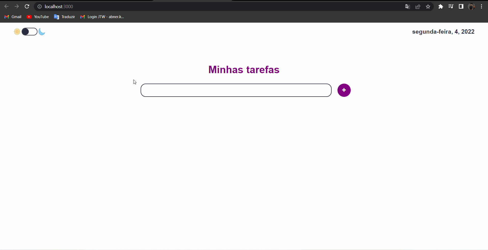

# Login de Usuário usando Node.js e Mongo DB

## Um mural de avisos com as seguintes tecnologias:

 

## Funcionalidades:
- Listar e apagar Tarefa.
- Traefas e modo dark/light Salvos no localStorage.
- Totalmente Responsivo

## Descrição:
- Para testar as skills que venho adquirindo ao longo do curso ProgramadorBR, em conjunto com o projeto desenvolvido pelo curso, fiz um Todo-List que alem de salvar e apagar as tarefas, também tem modo light e dark.
- Para fazer a persistência de dados utilizei o LocalStorage para salvar os dados e o modo escolhido na máquina do Usúario
## Apresentação do Pojeto:
- 

## Observação:
- Não consegui subir o porjeto, mas ele está disponível no google drive: https://drive.google.com/file/d/1HstdatGzxHqFSj4atuEo7sPhnPKsFyBz/view?usp=sharing
- Para rodar apenas basta baixar e no terminal colocar: npm start e no navegador: http://localhost:3000
- Pronto, fazendo esses passos você pode testar a aplicação

## Gostou do meu projeto? :D Entre em contato comigo! 
- [Linkedin](https://www.linkedin.com/in/abner-santos-b195b8228/)  
- [Email: abner.kif1@gmail.com](mailto:abner.kif1@gmail.com)
